# Encoders

Encoders transform media files into OpenAI-compatible Message dicts ready for VLM chat/completions APIs. Each encoder is registered via `@register_encoder` and can be used with `mm cat -p <name>`.

```
file → encoder → [{"role": "user", "content": [...]}] → LLM (if pipeline has generate step)
```

## Current Encoders

### Image

| Name | Description | Parameters |
|------|-------------|------------|
| `image-resize` | Resize to bounding box, base64 encode. Uses Rust fast-path when available, Pillow fallback. EXIF orientation applied. | `max_width=1024` |
| `image-tile` | Resized overview + tile crops in a single message. Gives VLMs both global context and fine detail. Falls back to overview-only when image fits in one tile. | `max_width=1024` |

#### `image-resize`

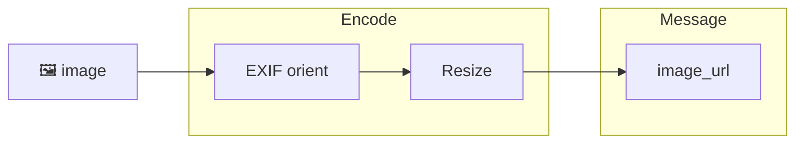

#### `image-tile`

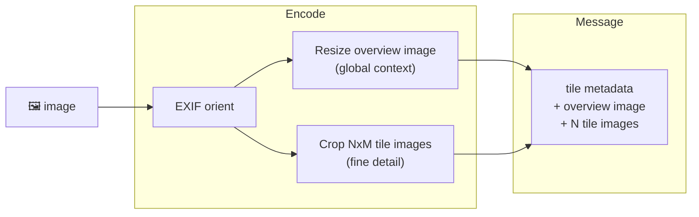


### Video

| Name | Description | Parameters |
|------|-------------|------------|
| `video-mosaic` | Scene-aware frame extraction + tiled mosaic grids. Default for fast mode. Uses PySceneDetect when available, falls back to uniform sampling. | `tile_cols=4`, `tile_rows=4`, `thumb_width=160`, `num_mosaics=8`, `num_frames=128` |
| `video-mosaic-w-transcript` | `video-mosaic` + Whisper transcript prepended. | + transcript opts |
| `video-frames` | Extract frames at N fps via parallel ffmpeg seeking, batch into messages (max 16 frames each). Text header with time range per batch. | `fps=1.0`, `max_width=1024`, `max_frames_per_message=16` |
| `video-frames-w-transcript` | Frame sampling + Whisper audio transcription. Transcript yielded first as context, then batched frames. Default for accurate mode. Falls back to frame-only when Whisper is unavailable. | `fps=1.0`, `max_width=1024`, `max_frames_per_message=16`, `whisper_model=medium`, `language=auto`, `audio_speed=1.0` |
| `video-keyframes` | Extract I-frames (keyframes) directly from the video bitstream. | `max_keyframes=None`, `max_width=1024`, `max_keyframes_per_message=16` |
| `video-keyframes-w-transcript` | `video-keyframes` + Whisper transcript prepended. | + transcript opts |
| `video-shots` | PySceneDetect shot detection, extract representative frames per shot. One message per shot. | `threshold=27.0`, `max_frames_per_shot=8`, `max_width=1024` |
| `video-shots-w-transcript` | `video-shots` + Whisper transcript prepended. | + transcript opts |
| `video-shot-mosaic` | PySceneDetect shot detection, build a mosaic grid per shot. One message per shot. | `threshold=27.0`, `tile_cols=4`, `tile_rows=4`, `thumb_width=160` |
| `video-shot-mosaic-w-transcript` | `video-shot-mosaic` + Whisper transcript prepended. | + transcript opts |
| `video-chunks` | Split into overlapping time-based chunks, extract frames per chunk. One message per chunk with time range header. | `chunk_duration=60`, `overlap=20`, `max_width=1024`, `frames_per_chunk=16` |
| `video-clips` | Base64-encode video clips of uniform duration (no frame extraction). | `duration=0`, `max_size_mb=None` |
| `video-clips-w-transcript` | `video-clips` + Whisper transcript prepended. | + transcript opts |
| `video-summary` | Adaptive N-frame visual summary of a video. | `num_frames=12`, `use_scene_detection=True`, `max_width=1024` |
| `video-summary-w-transcript` | `video-summary` + Whisper transcript prepended. | + transcript opts |
| `video-transcript` | Whisper transcript only (no frames / no images). | `whisper_model=medium`, `language=auto`, `audio_speed=1.0` |
| `video-captions` | Extract embedded subtitle stream from video; falls back to Whisper. | `subtitle_stream=0`, `fallback_to_whisper=True`, `whisper_model=medium`, `language=auto`, `audio_speed=1.0` |
| `video-gemini` | Gemini native `inline_data` passthrough. Sends the entire video file. Rust fast-path with Python fallback. | — |
| `video-gemini-chunked` | Gemini passthrough with duration-based chunking via ffmpeg. Each chunk as a separate Gemini Part. | `max_seconds=120`, `overlap=10` |

#### `video-mosaic`

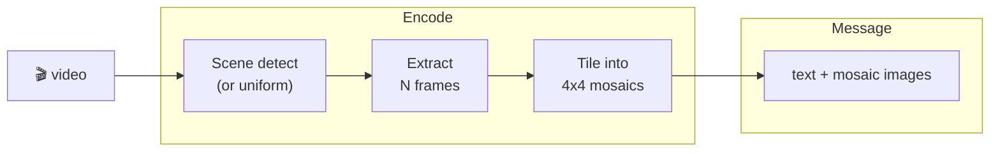

#### `video-frames`

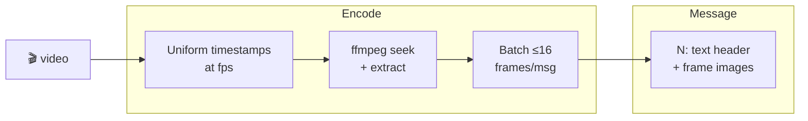

#### `video-frames-w-transcript`

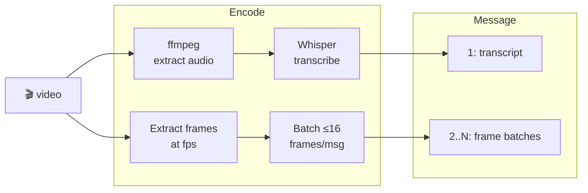

#### `video-chunks`


#### `video-shots`

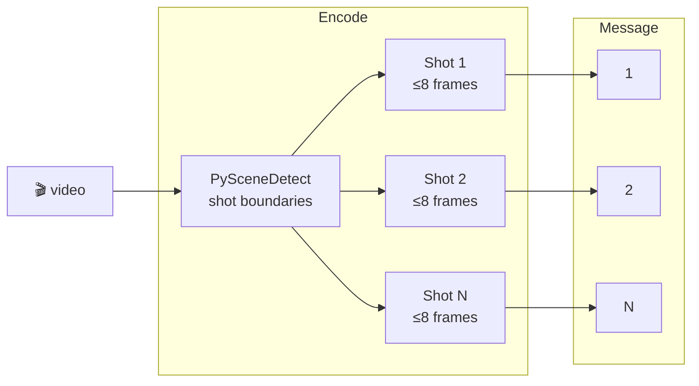

#### `video-shot-mosaic`

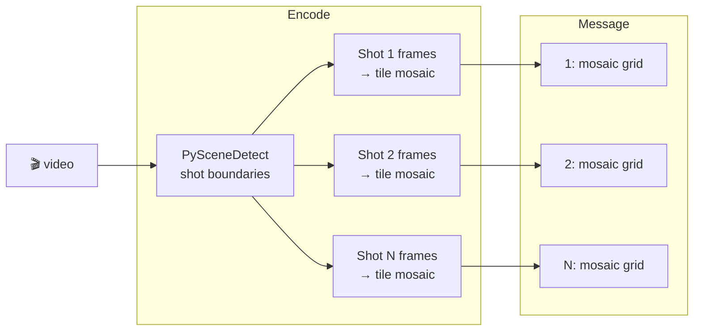

#### `video-gemini`

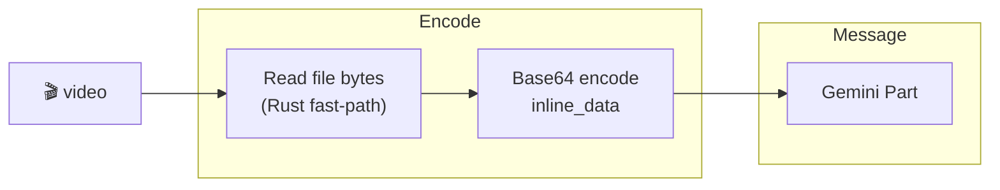

#### `video-gemini-chunked`

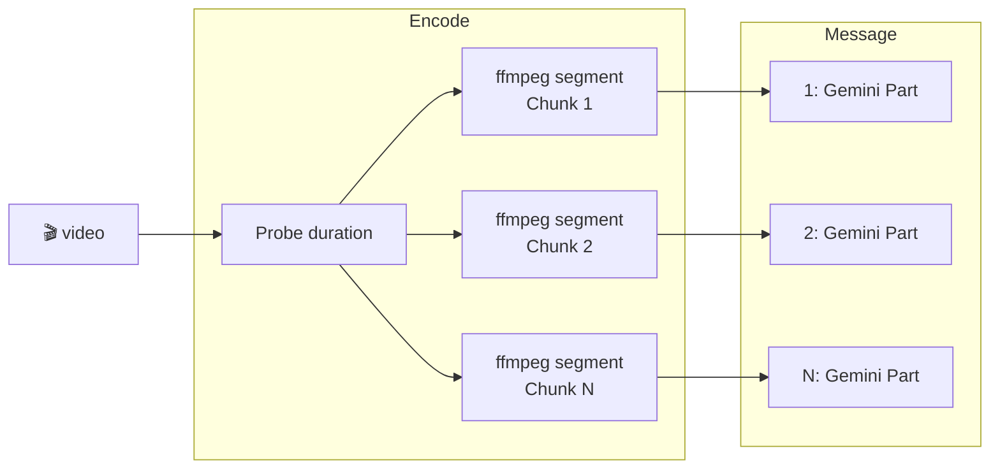

### Audio

| Name | Description | Parameters |
|------|-------------|------------|
| `audio-base64` | Send the raw audio file as a base64-encoded `input_audio` part. Default for Python `Context.to_messages()`. | `format` (auto-detected from extension) |
| `audio-transcribe` | Extract audio via ffmpeg, transcribe with Whisper (lightning-whisper-mlx / faster-whisper). Returns timestamped transcript as text message. | `whisper_model=medium`, `language=auto`, `audio_speed=1.0`, optional `backend`/`base_url`/`api_key` for remote |
| `audio-gemini` | Gemini native `inline_data` passthrough for audio files. Splits into overlapping chunks for files longer than `max_seconds`. | `max_seconds=120`, `overlap=10` |

#### `audio-transcribe`

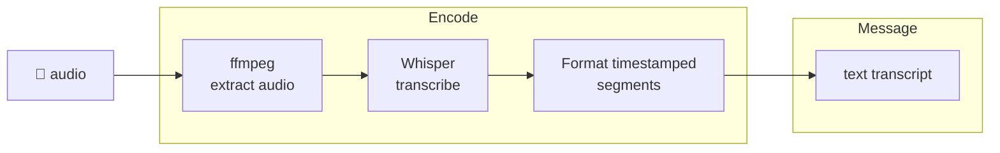

#### `audio-gemini`

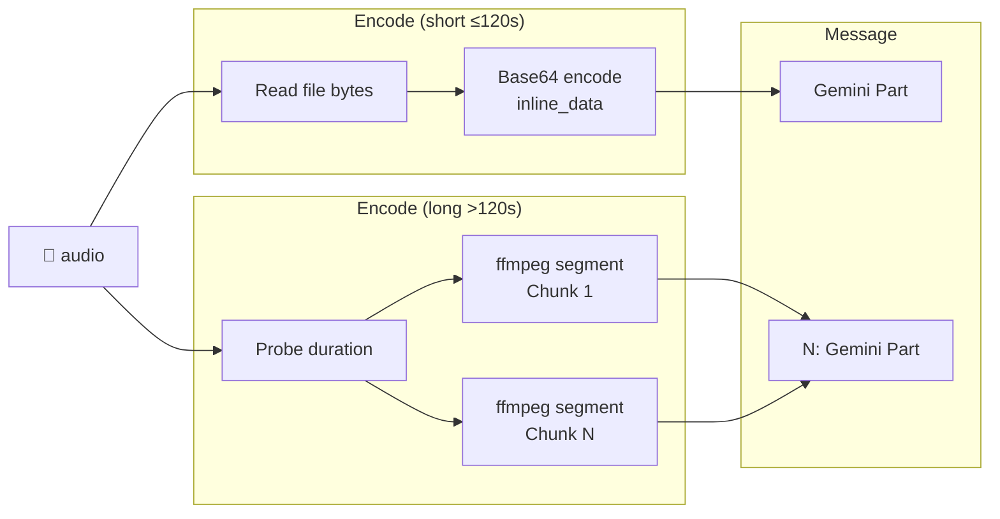

### Document

| Name | Description | Parameters |
|------|-------------|------------|
| `document-page-text` | Text-per-page extraction from PDF/DOCX/PPTX as structured text messages (no rasterization). Default for fast mode. Much lighter than `rasterize`. | `pages_per_message=4`, `max_pages=None` |
| `document-rasterize` | Render PDF pages as JPEG images via pypdfium2, batch into messages. Text header with page range per batch. | `max_width=1024`, `pages_per_message=4`, `max_pages=None` |
| `document-rasterize-text` | Rasterize pages + interleave extracted text after each image. Useful when VLM benefits from OCR fallback. | `max_width=1024`, `pages_per_message=4`, `max_pages=None` |
| `document-gemini` | Gemini native `inline_data` passthrough. Sends the entire document file. Rust fast-path with Python fallback. | — |

#### `document-page-text`

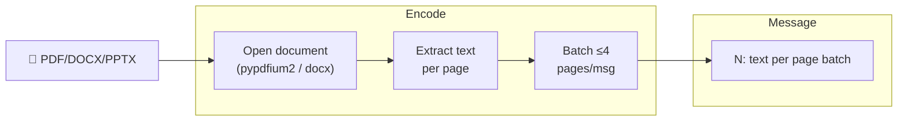

#### `document-rasterize`

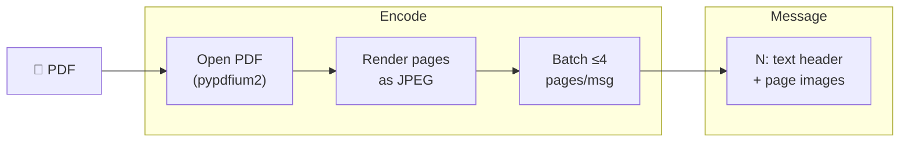

#### `document-rasterize-text`

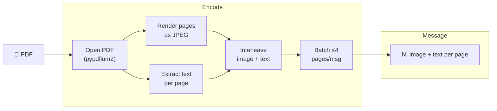

#### `document-gemini`

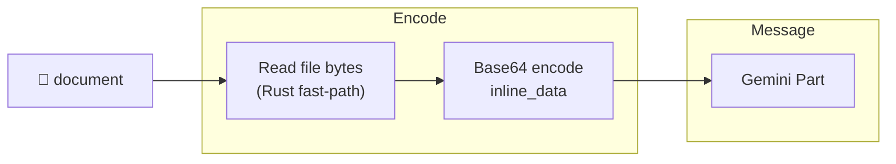

---

## Planned Encoders

### Image

| Name | Description | Parameters |
|------|-------------|------------|
| `image-crop-grid` | Fixed NxM grid crop (e.g. 3x3). Unlike `tile` which uses fixed pixel size, this always produces exactly N\*M tiles regardless of image dimensions. | `rows=3`, `cols=3`, `max_width=1024` |
| `image-metadata` | EXIF metadata, dimensions, and histogram stats as a structured text message. Analysis without sending pixel data. | `include_exif=true`, `include_histogram=false` |

### Video

| Name | Description | Parameters |
|------|-------------|------------|
| `video-transcript` | Extract audio → Whisper transcription only, no visual frames. For podcasts, talks, interviews. | `whisper_model=medium`, `audio_speed=1.0` |

### Document

| Name | Description | Parameters |
|------|-------------|------------|
| `document-ocr` | OCR fallback for scanned/image-only PDFs where pypdfium2 returns empty text. Rasterize then OCR via tesseract or VLM. | `max_width=1024`, `ocr_engine=tesseract`, `max_pages=None` |

---

## Writing Custom Encoders

Drop a `.py` file in `encoders/image/`, `encoders/video/`, or `~/.config/mm/encoders/`. Use the `@register_encoder` decorator:

```python
from pathlib import Path
from mm.encoders import register_encoder

@register_encoder(name="my-custom", media_types=("video",))
def my_custom(path: Path, **kw):
    yield {"role": "user", "content": [
        {"type": "text", "text": f"Processing {path.name}"}
    ]}
```

### Multi-chunk encoders

Encoders that yield multiple Messages (e.g. one per video shot) are processed sequentially via `generate_chunked`. Each Message gets its own LLM call and results are concatenated. This avoids OOM from loading all chunks into memory simultaneously.

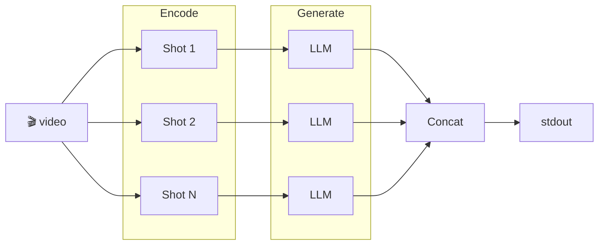

### Encoder Protocol

```python
class MessageStrategy(Protocol):
    name: str
    media_types: tuple[str, ...]

    def encode(self, path: Path, **kwargs) -> Iterable[Message]:
        ...
```

Where `Message = dict[str, Any]` is an OpenAI-compatible message dict: `{"role": "user", "content": [...]}`.

---

## Gaps

Python's `FileKind` recognizes 5 kinds (`image`, `video`, `audio`, `document`, `text`) while the Rust core recognizes 9 (`Code`, `Image`, `Document`, `Video`, `Audio`, `Data`, `Config`, `Text`, `Other`). The Python `file_kind()` function collapses `code`, `data`, `config`, and `other` into `text`. Pipelines only exist for image, video, audio, and document — text and code files pass through as raw content without an encoder or pipeline.
