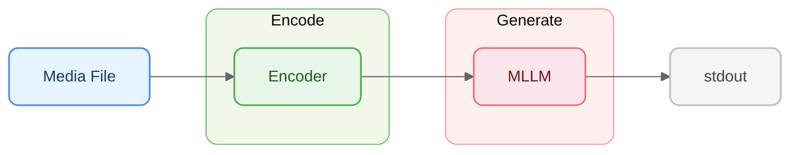

# Pipelines

Pipelines configure a 2-stage flow for LLM-based media understanding:
**encode** (via an encoder) then **generate** (LLM call) to produce text output.



Each pipeline is a YAML file under `pipelines/{kind}/{mode}.yaml` that references
an encoder from `mm/encoders/` and configures LLM generation parameters.

```bash
mm cat photo.jpg -p resize          # named encoder
mm cat video.mp4 -p shot-mosaic     # scene-aware video encoder

# Override pipeline config from CLI
mm cat photo.jpg -m accurate --encode.strategy tile
mm cat photo.jpg -m accurate --generate.max-tokens 1024 --generate.temperature 0.5

# Load explicit pipeline YAML (repeatable, dispatched by kind)
mm cat photo.jpg -p ~/my-image-pipeline.yaml
mm cat *.jpg *.mp4 -p image.yaml -p video.yaml

# Custom Python transform via pyfunc
mm cat photo.jpg -m accurate --encode.pyfunc ~/my_filter.py
```

### Example `my_filter.py`

A pyfunc file must define `transform(parts, context) -> list[dict]`.
`parts` is a list of OpenAI-compatible message content dicts (e.g.
`{"type": "text", ...}` or `{"type": "image_url", ...}`); `context` is
file metadata (name, kind, size, etc.).

```python
# ~/my_filter.py — keep only image parts and prepend a custom instruction
def transform(parts: list[dict], context: dict) -> list[dict]:
    images = [p for p in parts if p.get("type") == "image_url"]
    header = {"type": "text", "text": f"Analyze {context['name']} in detail."}
    return [header, *images]
```

Inline variants also work inside a pipeline YAML:

```yaml
encode:
  strategy: resize
  pyfunc: |
    def transform(parts, context):
        return [p for p in parts if p.get("type") == "image_url"]
```

## Encoders

See [ENCODERS.md](ENCODERS.md) for the full encoder reference — all built-in encoders, parameters, planned encoders, and how to write custom encoders.
