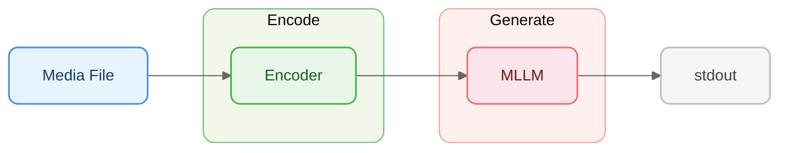

# Pipelines

Pipelines configure a 2-stage flow for LLM-based media understanding:
**encode** (via an encoder) then **generate** (LLM call) to produce text output.



Each pipeline is a YAML file under `pipelines/{kind}/{mode}.yaml` that references
an encoder from `mm/encoders/` and configures LLM generation parameters.

> **Mode required.** Pipelines run only when `--mode fast` or `--mode accurate`
> is selected. The default `--mode metadata` does local extraction with no
> pipeline, so `-p`, `--encode.*`, and `--generate.*` are ignored unless you
> also pass an explicit `-m fast`/`-m accurate`.

```bash
mm cat photo.jpg -m fast -p resize          # named encoder (fast pipeline)
mm cat video.mp4 -m fast -p shot-mosaic     # scene-aware video encoder

# Override pipeline config from CLI
mm cat photo.jpg -m accurate --encode.strategy tile
mm cat photo.jpg -m accurate --generate.max-tokens 1024 --generate.temperature 0.5
mm cat photo.jpg -m accurate --prompt "Describe in one sentence." --model moondream2

# Override individual strategy_opts entries (repeatable, KEY=VALUE form)
mm cat photo.jpg -m accurate --encode.strategy_opts max_width=768
mm cat video.mp4 -m accurate --encode.strategy_opts max_width=768 --encode.strategy_opts fps=5

# Inspect the YAML source of a built-in pipeline (use as a template for your own)
mm cat --print-pipeline image/accurate

# Load explicit pipeline YAML (repeatable, dispatched by kind)
mm cat photo.jpg -m accurate -p ~/my-image-pipeline.yaml
mm cat *.jpg *.mp4 -m accurate -p image.yaml -p video.yaml

# Custom Python transform via pyfunc
mm cat photo.jpg -m accurate --encode.pyfunc ~/my_filter.py

# Per-call model + extra_body for provider-specific knobs
# (e.g. vlmrt's method/method_params/video_fps/image_resolution).
mm --profile vlmrt cat photo.jpg -m accurate \
  --model moondream2 \
  --generate.extra-body '{"method":"detect","method_params":{"object":"fish"}}'
```

## `generate.model` — pinning a model per pipeline

The `generate` block accepts an optional `model:` string that overrides
the active profile's default model whenever this pipeline is used.
Leaving it unset (or `null`) means "use the profile model". Useful for
shipping a pipeline that always targets a specific deployment-side model
(e.g. an OCR pipeline that always wants `paddleocr-v5`).

```yaml
# ~/.config/mm/pipelines/image/accurate.yaml
kind: image
mode: accurate
generate:
  prompt: Read every line of text on this image.
  model: paddleocr-v5
  extra_body:
    method: ocr
```

CLI `--model` / `--generate.model` always wins over a pipeline-pinned
model.

## `generate.extra_body` — provider-specific knobs

The `generate` block accepts an arbitrary `extra_body:` mapping that is
forwarded verbatim to the OpenAI SDK's `extra_body=` argument. Use it when
your endpoint needs request fields beyond the standard OpenAI surface
(temperature/max_tokens/json_mode are still first-class fields).

```yaml
# ~/.config/mm/pipelines/image/accurate.yaml
kind: image
mode: accurate
encode:
  strategy: resize
  strategy_opts: { max_width: 1024 }
generate:
  prompt: Describe this image.
  max_tokens: 512
  extra_body:
    method: caption
    method_params:
      length: normal
    image_resolution: "448x448"
```

Anything passed via `mm cat --generate.extra-body '<json>'` **deep-merges
on top** of the pipeline-level `extra_body`, so per-call CLI flags can
override individual keys without discarding the YAML defaults. The
combined `extra_body` (along with the resolved `model`) is included in
the L2 cache key so cached results are invalidated when knobs change.

## Override surfaces — full precedence rules

For every `cat` invocation the effective LLM call comes from three layers
(right-most wins on conflict):

```
profile (mm.toml)  ->  pipeline YAML (generate.*)  ->  CLI flags on `cat`
  base_url              prompt                          --prompt / --generate.prompt
  api_key               model                           --model  / --generate.model
  model (default)       max_tokens                      --generate.max-tokens
                        temperature                     --generate.temperature
                        json_mode                       --generate.json-mode
                        extra_body                      --generate.extra-body
                                                        (deep-merged onto YAML)
```

`base_url` and `api_key` are profile-only — they have no pipeline or CLI
override.

### Example `my_filter.py`

A pyfunc file must define `transform(parts, context) -> list[dict]`.
`parts` is a list of OpenAI-compatible message content dicts (e.g.
`{"type": "text", ...}` or `{"type": "image_url", ...}`); `context` is
file metadata (name, kind, size, etc.).

```python
# ~/my_filter.py — keep only image parts and prepend a custom instruction
def transform(parts: list[dict], context: dict) -> list[dict]:
    images = [p for p in parts if p.get("type") == "image_url"]
    header = {"type": "text", "text": f"Analyze {context['name']} in detail."}
    return [header, *images]
```

Inline variants also work inside a pipeline YAML:

```yaml
encode:
  strategy: resize
  pyfunc: |
    def transform(parts, context):
        return [p for p in parts if p.get("type") == "image_url"]
```

## Encoders

See [ENCODERS.md](ENCODERS.md) for the full encoder reference — all built-in encoders, parameters, planned encoders, and how to write custom encoders.
