# Encoders

Encoders transform media files into OpenAI-compatible Message dicts ready for VLM chat/completions APIs. Each encoder is registered via `@register_encoder` and can be used with `mm cat -p <name>`.

```
file → encoder → [{"role": "user", "content": [...]}] → LLM (if pipeline has generate step)
```

## Current Encoders

### Image

#### `resize`

Resize to bounding box, base64 encode. Uses Rust fast-path when available, Pillow fallback. EXIF orientation applied. **Parameters:** `max_width=1024`

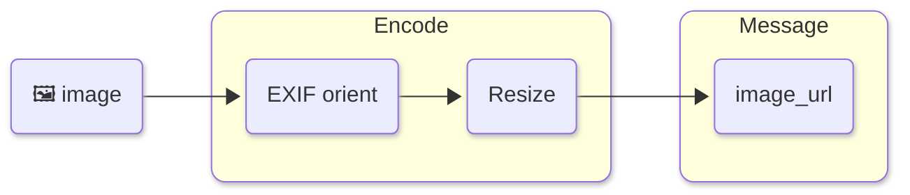

---

#### `tile`

Resized overview + tile crops in a single message. Gives VLMs both global context and fine detail. Falls back to overview-only when image fits in one tile. **Parameters:** `max_width=1024`

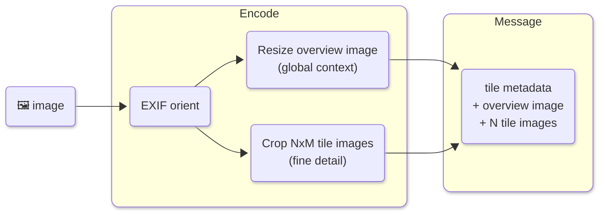

---

### Video

#### `mosaic`

Scene-aware frame extraction + tiled mosaic grids. Default for fast mode. Uses PySceneDetect when available, falls back to uniform sampling. **Parameters:** `tile_cols=4, tile_rows=4, thumb_width=160, num_mosaics=8, num_frames=128`

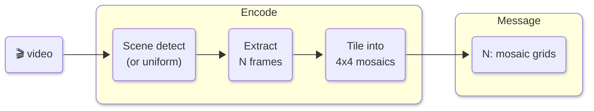

---

#### `mosaic-w-transcript`

`mosaic` + Whisper transcript prepended as the first message. **Parameters:** `tile_cols=4, tile_rows=4, thumb_width=160, num_mosaics=8, num_frames=128, model=None, language=auto, audio_speed=2.0`

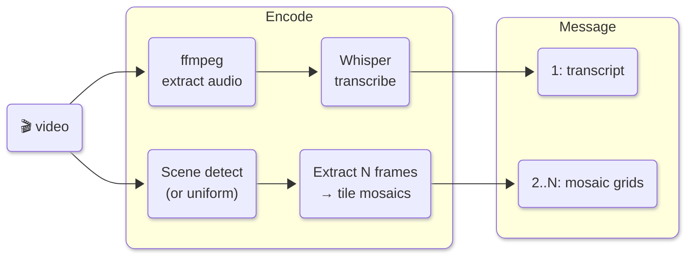

---

#### `frames`

Extract frames at N fps via parallel ffmpeg seeking, batch into messages (max 16 frames each). Text header with time range per batch. **Parameters:** `fps=1.0, max_width=1024, max_frames_per_message=16`

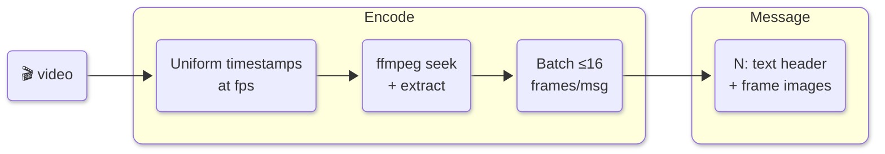

---

#### `frames-w-transcript`

Frame sampling + Whisper audio transcription. Transcript yielded first as context, then batched frames. Default for accurate mode. Falls back to frame-only when Whisper is unavailable. **Parameters:** `fps=1.0, max_width=1024, max_frames_per_message=16, model=None, language=auto, audio_speed=2.0`

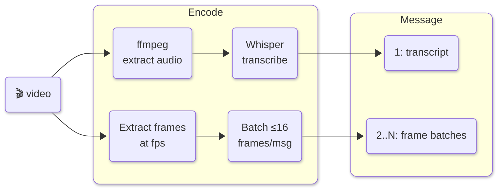

---

#### `keyframes`

Extract I-frames (keyframes) directly from the video bitstream. **Parameters:** `max_keyframes=None, max_width=1024, max_keyframes_per_message=16`

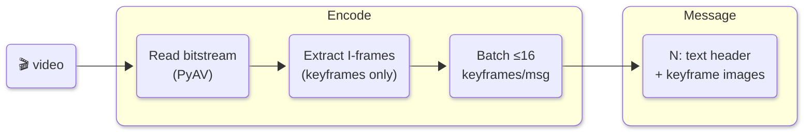

---

#### `keyframes-w-transcript`

`keyframes` + Whisper transcript prepended as the first message. **Parameters:** `max_keyframes=None, max_width=1024, max_keyframes_per_message=16, model=None, language=auto, audio_speed=2.0`

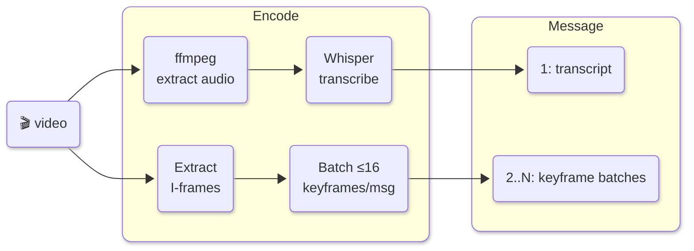

---

#### `shots`

PySceneDetect shot detection, extract representative frames per shot. One message per shot. **Parameters:** `threshold=27.0, max_frames_per_shot=8, max_width=1024`

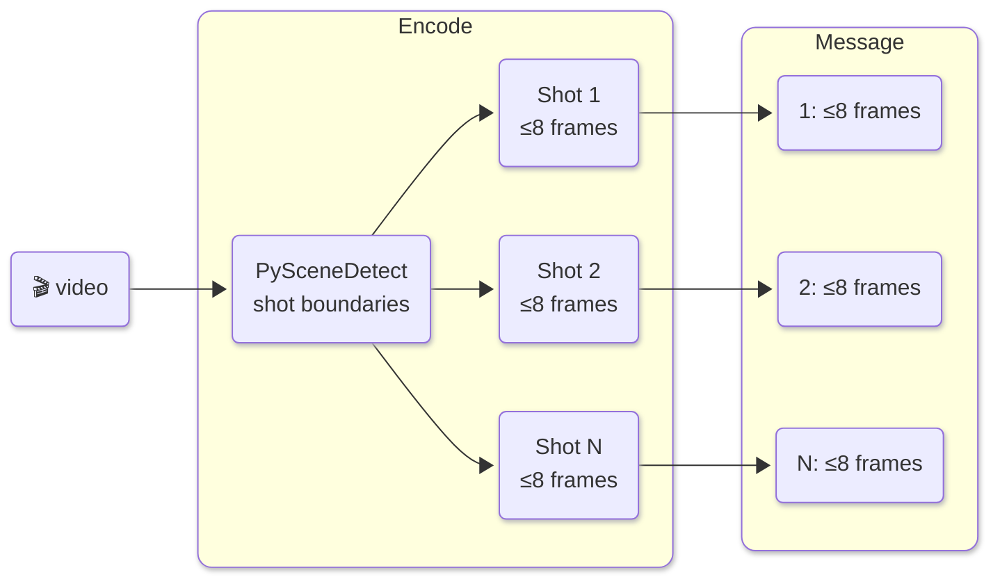

---

#### `shots-w-transcript`

`shots` + Whisper transcript prepended as the first message. **Parameters:** `threshold=27.0, max_frames_per_shot=8, max_width=1024, model=None, language=auto, audio_speed=2.0`

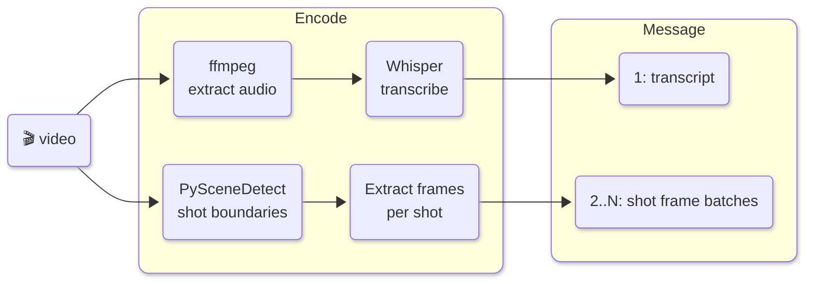

---

#### `shot-mosaic`

PySceneDetect shot detection, build a mosaic grid per shot. One message per shot. **Parameters:** `threshold=27.0, tile_cols=4, tile_rows=4, thumb_width=160`

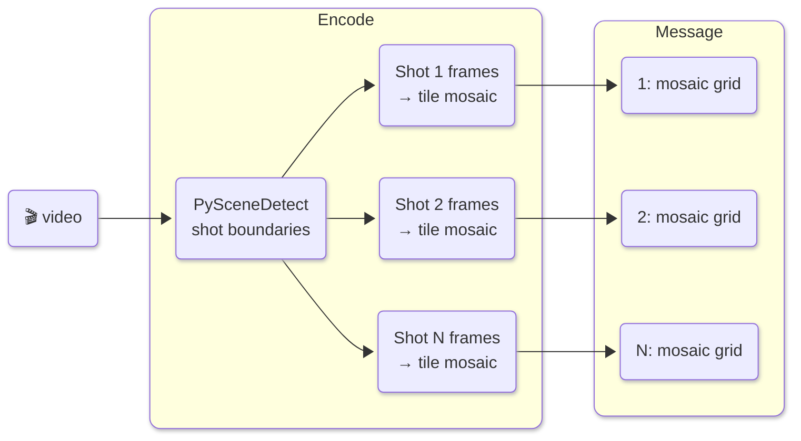

---

#### `shot-mosaic-w-transcript`

`shot-mosaic` + Whisper transcript prepended as the first message. **Parameters:** `threshold=27.0, tile_cols=4, tile_rows=4, thumb_width=160, model=None, language=auto, audio_speed=2.0`

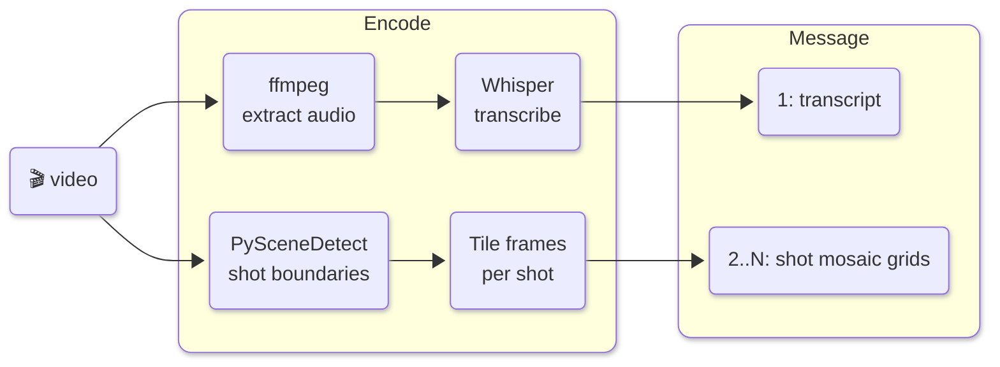

---

#### `chunked`

Split into overlapping time-based chunks, extract frames per chunk. One message per chunk with time range header. **Parameters:** `chunk_duration=60, overlap=5, max_width=1024, frames_per_chunk=16`

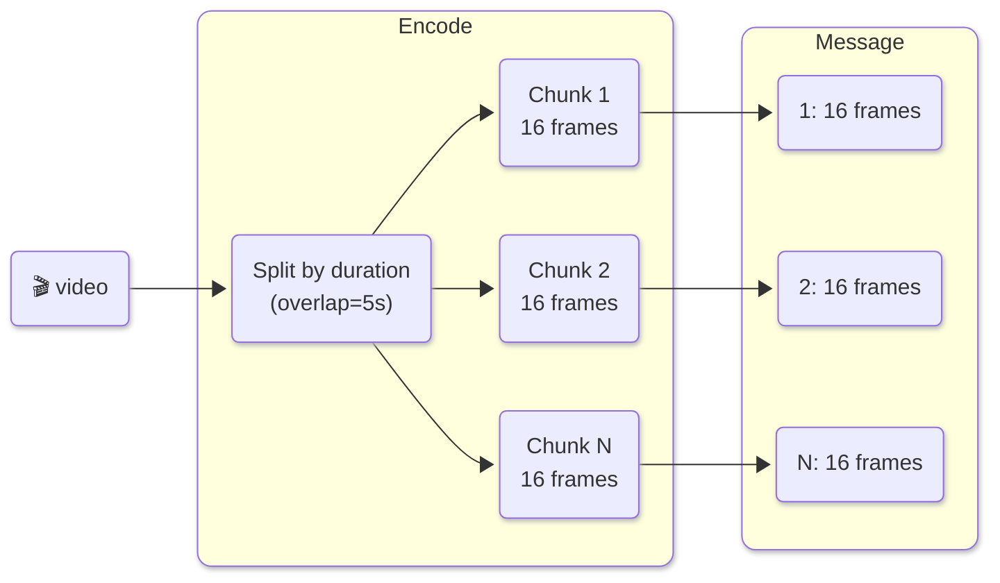

---

#### `clips`

Base64-encode video clips. Videos ≤ `duration` seconds are sent whole; longer videos are split into overlapping `duration`-second chunks. Each clip sent as a `video_url` base64 part — useful for models with native video input. **Parameters:** `duration=120, overlap=10, max_size_mb=None`

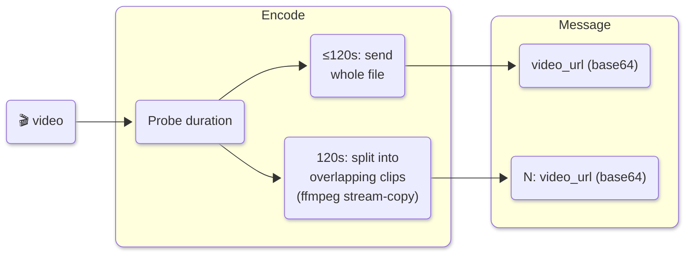

---

#### `clips-w-transcript`

`clips` + Whisper transcript prepended as the first message. **Parameters:** `duration=120, overlap=10, max_size_mb=None, model=None, language=auto, audio_speed=2.0`

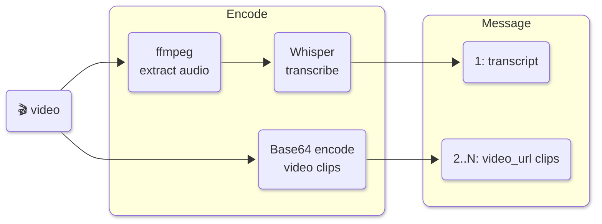

---

#### `summary`

Adaptive N-frame visual summary. Uses PySceneDetect to spread frames across scene boundaries when available; falls back to uniform sampling. **Parameters:** `num_frames=12, use_scene_detection=True, max_width=1024`

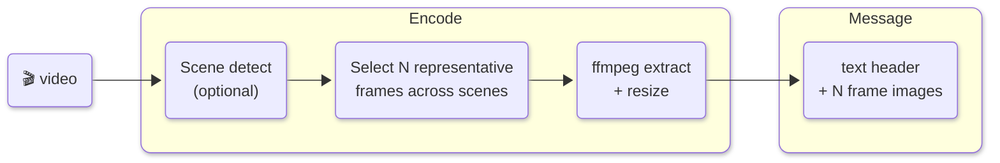

---

#### `summary-w-transcript`

`summary` + Whisper transcript prepended as the first message. **Parameters:** `num_frames=12, use_scene_detection=True, max_width=1024, model=None, language=auto, audio_speed=2.0`

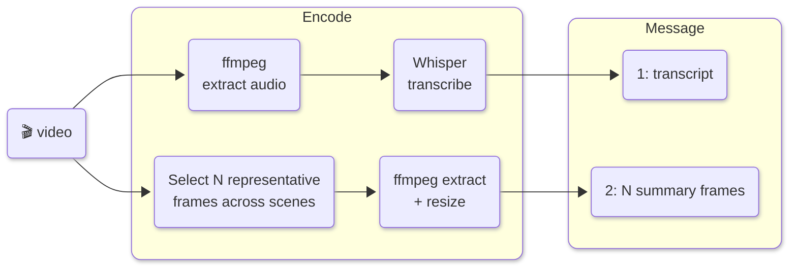

---

#### `transcript`

Extract audio track → Whisper transcription only, no visual frames. For podcasts, talks, interviews. **Parameters:** `model=None, language=auto, audio_speed=2.0`

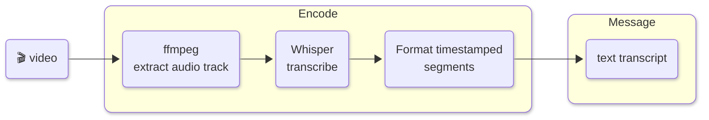

---

#### `captions`

Extract embedded subtitle stream (SRT/VTT/SSA) from video; falls back to Whisper transcription if no subtitle track is found. **Parameters:** `subtitle_stream=0, fallback_to_whisper=True, model=None, language=auto, audio_speed=2.0, backend=None, base_url=None, api_key=None`

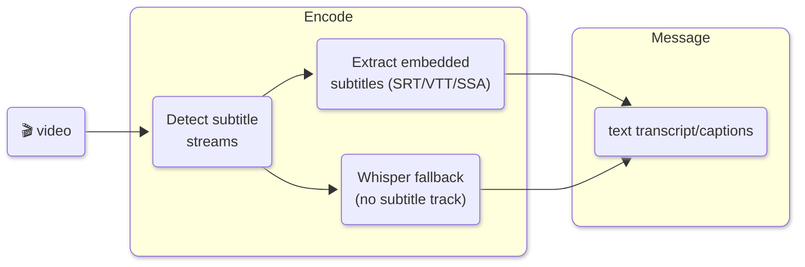

---

#### `native`

Send the entire video file as a base64 `video_url` data URL. No probing, chunking, or frame extraction.

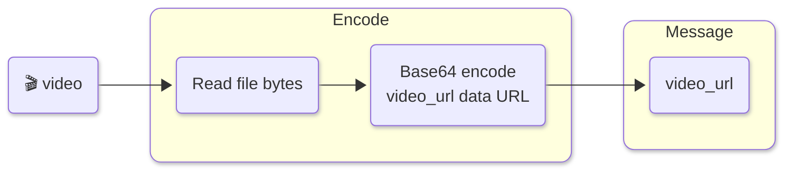

---

#### `gemini-native`

Gemini native `inline_data` passthrough. Sends the entire video file. Rust fast-path with Python fallback.

```mermaid
%%{init: {'look': 'neo'} }%%
graph LR
  video("🎬 video")

  subgraph encode ["Encode"]
    read("Read file bytes\n(Rust fast-path)")
    b64("Base64 encode\ninline_data")
  end

  subgraph message ["Message"]
    msg("Gemini Part")
  end

  video --> read --> b64 --> msg
  style encode rx:10px,ry:10px
  style message rx:10px,ry:10px
```

---

#### `gemini-chunked`

Gemini passthrough with duration-based chunking via ffmpeg. Each chunk as a separate Gemini Part. **Parameters:** `max_seconds=120, overlap=10`

```mermaid
%%{init: {'look': 'neo'} }%%
graph LR
  video("🎬 video")

  subgraph encode ["Encode"]
    probe("Probe duration")
    c1("ffmpeg segment\nChunk 1")
    c2("ffmpeg segment\nChunk 2")
    c3("ffmpeg segment\nChunk N")
  end

  subgraph message ["Message"]
    m1("1: Gemini Part")
    m2("2: Gemini Part")
    m3("N: Gemini Part")
  end

  video --> probe
  probe --> c1 --> m1
  probe --> c2 --> m2
  probe --> c3 --> m3
  style encode rx:10px,ry:10px
  style message rx:10px,ry:10px
```

---

### Audio

#### `base64`

Send the raw audio file as a base64-encoded `input_audio` part. Default for Python `Context.to_messages()`. For files longer than `max_seconds`, splits into overlapping chunks via ffmpeg and yields one Message per chunk. **Parameters:** `format=auto, max_seconds=120, overlap=10`

```mermaid
%%{init: {'look': 'neo'} }%%
graph LR
  audio("🎵 audio")

  subgraph encode_short ["Encode (≤120s)"]
    read("Read file bytes")
    b64("Base64 encode\ninput_audio")
  end

  subgraph encode_long ["Encode (>120s)"]
    probe("Probe duration")
    c1("ffmpeg segment\nChunk 1")
    c2("ffmpeg segment\nChunk N")
    b64c("Base64 encode\neach chunk")
  end

  subgraph message ["Message"]
    msg1("input_audio part")
    msgN("N: input_audio parts")
  end

  audio --> read --> b64 --> msg1
  audio --> probe
  probe --> c1 --> b64c --> msgN
  probe --> c2 --> b64c
  style encode_short rx:10px,ry:10px
  style encode_long rx:10px,ry:10px
  style message rx:10px,ry:10px
```

---

#### `transcribe`

Extract audio via ffmpeg, transcribe with Whisper (lightning-whisper-mlx / faster-whisper). Returns timestamped transcript as a text message. **Parameters:** `model=None, language=auto, audio_speed=2.0, backend=None, base_url=None, api_key=None`

```mermaid
%%{init: {'look': 'neo'} }%%
graph LR
  audio("🎵 audio")

  subgraph encode ["Encode"]
    extract("ffmpeg\nextract audio")
    whisper("Whisper\ntranscribe")
    fmt("Format timestamped\nsegments")
  end

  subgraph message ["Message"]
    msg("text transcript")
  end

  audio --> extract --> whisper --> fmt --> msg
  style encode rx:10px,ry:10px
  style message rx:10px,ry:10px
```

---

#### `gemini-native`

Pass the audio file as a base64-encoded `input_audio` part (OpenAI format), with automatic chunking for files longer than `max_seconds`. Each chunk yielded as a separate Message. **Parameters:** `max_seconds=120, overlap=10`

```mermaid
%%{init: {'look': 'neo'} }%%
graph LR
  audio("🎵 audio")

  subgraph encode ["Encode (short ≤120s)"]
    read("Read file bytes")
    b64("Base64 encode\ninline_data")
  end

  subgraph encode2 ["Encode (long >120s)"]
    probe("Probe duration")
    c1("ffmpeg segment\nChunk 1")
    c2("ffmpeg segment\nChunk N")
  end

  subgraph message ["Message"]
    msg1("Gemini Part")
    msgN("N: Gemini Part")
  end

  audio --> read --> b64 --> msg1
  audio --> probe
  probe --> c1 --> msgN
  probe --> c2 --> msgN
  style encode rx:10px,ry:10px
  style encode2 rx:10px,ry:10px
  style message rx:10px,ry:10px
```

---

### Document

#### `page-text`

Text-per-page extraction from PDF/DOCX/PPTX as structured text messages (no rasterization). Default for fast mode. Much lighter than `rasterize`. **Parameters:** `pages_per_message=128, max_pages=None`

```mermaid
%%{init: {'look': 'neo'} }%%
graph LR
  doc("📄 PDF/DOCX/PPTX")

  subgraph encode ["Encode"]
    open("Open document\n(pypdfium2 / docx)")
    extract("Extract text\nper page")
    batch("Batch ≤128\npages/msg")
  end

  subgraph message ["Message"]
    msgs("N: text per page batch")
  end

  doc --> open --> extract --> batch --> msgs
  style encode rx:10px,ry:10px
  style message rx:10px,ry:10px
```

---

#### `rasterize`

Render PDF pages as JPEG images via pypdfium2, batch into messages. Text header with page range per batch. **Parameters:** `max_width=1024, pages_per_message=4, max_pages=None`

```mermaid
%%{init: {'look': 'neo'} }%%
graph LR
  doc("📄 PDF")

  subgraph encode ["Encode"]
    open("Open PDF\n(pypdfium2)")
    render("Render pages\nas JPEG")
    batch("Batch ≤4\npages/msg")
  end

  subgraph message ["Message"]
    msgs("N: text header\n+ page images")
  end

  doc --> open --> render --> batch --> msgs
  style encode rx:10px,ry:10px
  style message rx:10px,ry:10px
```

---

#### `rasterize-text`

Rasterize pages + interleave extracted text after each image. Useful when the VLM benefits from an OCR fallback alongside the rendered page. **Parameters:** `max_width=1024, pages_per_message=4, max_pages=None`

```mermaid
%%{init: {'look': 'neo'} }%%
graph LR
  doc("📄 PDF")

  subgraph encode ["Encode"]
    open("Open PDF\n(pypdfium2)")
    render("Render pages\nas JPEG")
    text("Extract text\nper page")
    interleave("Interleave\nimage + text")
    batch("Batch ≤4\npages/msg")
  end

  subgraph message ["Message"]
    msgs("N: image + text per page")
  end

  doc --> open
  open --> render --> interleave
  open --> text --> interleave
  interleave --> batch --> msgs
  style encode rx:10px,ry:10px
  style message rx:10px,ry:10px
```

---

#### `gemini-native`

Gemini native `inline_data` passthrough. Sends the entire document file. Rust fast-path with Python fallback.

```mermaid
%%{init: {'look': 'neo'} }%%
graph LR
  doc("📄 document")

  subgraph encode ["Encode"]
    read("Read file bytes\n(Rust fast-path)")
    b64("Base64 encode\ninline_data")
  end

  subgraph message ["Message"]
    msg("Gemini Part")
  end

  doc --> read --> b64 --> msg
  style encode rx:10px,ry:10px
  style message rx:10px,ry:10px
```

---

## Planned Encoders

### Image

| Name | Description | Parameters |
|------|-------------|------------|
| `image-crop-grid` | Fixed NxM grid crop (e.g. 3x3). Unlike `tile` which uses fixed pixel size, this always produces exactly N\*M tiles regardless of image dimensions. | `rows=3, cols=3, max_width=1024` |
| `image-metadata` | EXIF metadata, dimensions, and histogram stats as a structured text message. Analysis without sending pixel data. | `include_exif=true, include_histogram=false` |

### Document

| Name | Description | Parameters |
|------|-------------|------------|
| `ocr` | OCR fallback for scanned/image-only PDFs where pypdfium2 returns empty text. Rasterize then OCR via tesseract or VLM. | `max_width=1024, ocr_engine=tesseract, max_pages=None` |

---

## Writing Custom Encoders

### Class-based (recommended)

Subclass `mm.encoders.base.Encoder`. This is the pattern all built-in encoders use and gives access to the `generate` class variable for per-mode LLM overrides:

```python
from pathlib import Path
from typing import Any, Iterable
from mm.encoders import register
from mm.encoders.base import Encoder, Message

class MyVideoEncoder(Encoder):
    name = "my-encoder"
    kind = "video"
    # Optional: suppress LLM call for both modes (encode-only)
    # generate = {"fast": None, "accurate": None}

    def encode(self, path: Path, **kwargs: Any) -> Iterable[Message]:
        yield {"role": "user", "content": [
            {"type": "text", "text": f"Processing {path.name}"}
        ]}

register(MyVideoEncoder())
```

### Function-based

For simple cases, drop a `.py` file in `~/.config/mm/encoders/` and use the `@register_encoder` decorator:

```python
from pathlib import Path
from mm.encoders import register_encoder

@register_encoder(name="my-custom", kind="video")
def my_custom(path: Path, **kw):
    yield {"role": "user", "content": [
        {"type": "text", "text": f"Processing {path.name}"}
    ]}
```

### Multi-chunk encoders

Encoders that yield multiple Messages (e.g. one per video shot) are processed sequentially via `generate_chunked`. Each Message gets its own LLM call and results are concatenated. This avoids OOM from loading all chunks into memory simultaneously.

```mermaid
%%{init: {'look': 'neo'} }%%
graph LR
  video("🎬 video")

  subgraph encode ["Encode"]
    s1("Shot 1")
    s2("Shot 2")
    s3("Shot N")
  end

  subgraph generate ["Generate"]
    g1("LLM")
    g2("LLM")
    g3("LLM")
  end

  concat("Concat")
  out("stdout")

  video --> s1
  video --> s2
  video --> s3
  s1 --> g1
  s2 --> g2
  s3 --> g3
  g1 --> concat
  g2 --> concat
  g3 --> concat
  concat --> out
  style encode rx:10px,ry:10px
  style generate rx:10px,ry:10px
```

### Encoder ABC

All built-in encoders extend `mm.encoders.base.Encoder`:

```python
class Encoder(ABC):
    name: ClassVar[str]          # registry key
    kind: ClassVar[str]          # "image" | "video" | "audio" | "document"
    generate: ClassVar[dict]     # per-mode generate overrides (default: {})

    @abstractmethod
    def encode(self, path: Path, **kwargs: Any) -> Iterable[Message]:
        ...
```

The `generate` dict maps mode strings (`"fast"`, `"accurate"`) to `Generate` objects or `None`. Setting a mode to `None` suppresses the LLM call entirely (encode-only for that mode). Resolution order, highest priority first:

```
CLI flags (--generate.*)
  → encoder generate[mode] override
  → pipeline YAML generate block
```

The `MessageStrategy` protocol is also satisfied by any object with `name`, `kind`, and `encode()`.

`Message = dict[str, Any]` — OpenAI-compatible message dict: `{"role": "user", "content": [...]}`.

---

## Gaps

Python's `FileKind` recognizes 5 kinds (`image`, `video`, `audio`, `document`, `text`) while the Rust core recognizes 9 (`Code`, `Image`, `Document`, `Video`, `Audio`, `Data`, `Config`, `Text`, `Other`). The Python `file_kind()` function collapses `code`, `data`, `config`, and `other` into `text`. Pipelines only exist for image, video, audio, and document — text and code files pass through as raw content without an encoder or pipeline.
