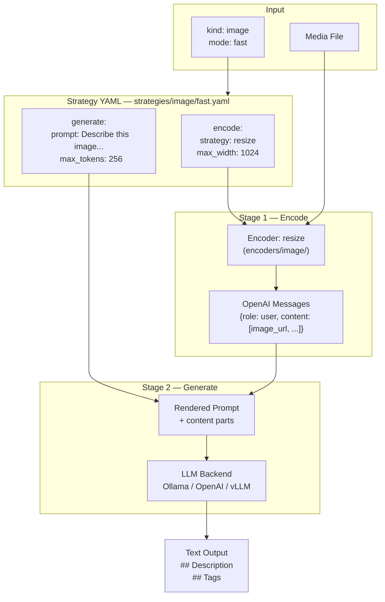
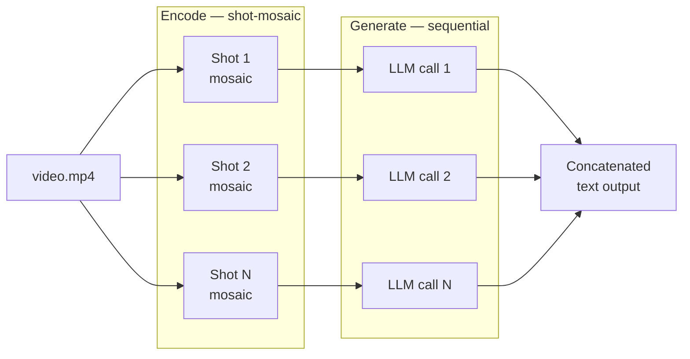

# mm Strategies

Strategies configure a 2-stage pipeline for LLM-based media understanding:
**encode** (via an encoder) then **generate** (LLM call) to produce text output.



Each strategy is a YAML file under `strategies/{kind}/{mode}.yaml` that references
an encoder from `mm/encoders/` and configures LLM generation parameters.

```bash
mm cat photo.jpg -s resize          # named encoder
mm cat video.mp4 -s shot-mosaic     # scene-aware video encoder
mm cat video.mp4 -s ~/my_encoder.py # custom file
mm cat photo.jpg -s 'def encode(path, **kw): ...'  # inline
```

## Built-in Encoders

### Image

| Name | Location | Description | Key Params |
|------|----------|-------------|------------|
| `resize` | [`encoders/image/__init__.py`](../encoders/image/__init__.py) | Fit image to bounding box (default 1024px), base64 JPEG. Rust fast-path with Pillow fallback. | `max_width` |
| `tile` | [`encoders/image/__init__.py`](../encoders/image/__init__.py) | Split image into `tile_size x tile_size` tiles, one Message per tile. | `tile_size` |
| `tile-overview` | [`encoders/image/tile_overview.py`](../encoders/image/tile_overview.py) | Resized overview + all tiles in a single Message. E.g. 4096px image -> 1 overview + 16 tiles = 17 images. | `max_width` |

### Video

| Name | Location | Description | Key Params |
|------|----------|-------------|------------|
| `frame-sample` | [`encoders/video/__init__.py`](../encoders/video/__init__.py) | Extract frames at N fps via parallel ffmpeg seeking, batch into Messages (max 16 frames each). | `fps`, `max_width`, `max_frames_per_message` |
| `video-chunk` | [`encoders/video/__init__.py`](../encoders/video/__init__.py) | Split video into overlapping time chunks (default 60s), extract frames per chunk. One Message per chunk. | `chunk_duration`, `overlap`, `max_width`, `frames_per_chunk` |
| `shot-frames` | [`encoders/video/shot.py`](../encoders/video/shot.py) | Detect shots via PySceneDetect, extract representative frames per shot, yield one Message per shot. Sequential to avoid OOM. | `threshold`, `max_frames_per_shot`, `max_width` |
| `shot-mosaic` | [`encoders/video/shot.py`](../encoders/video/shot.py) | Detect shots via PySceneDetect, build a mosaic grid per shot using `tile_frames_to_mosaics`. One Message per shot. | `threshold`, `tile_cols`, `tile_rows`, `thumb_width` |
| `gemini-video` | [`encoders/gemini.py`](../encoders/gemini.py) | Pass entire video as Gemini `inline_data` Part. Single Message. Rust fast-path. | -- |
| `gemini-video-chunked` | [`encoders/gemini.py`](../encoders/gemini.py) | Chunk video by duration (default 120s), each chunk as Gemini `inline_data`. | `max_seconds`, `overlap` |

### Document

| Name | Location | Description | Key Params |
|------|----------|-------------|------------|
| `rasterize` | [`encoders/document.py`](../encoders/document.py) | Render PDF pages as JPEG images via pypdfium2, batch 4 pages per Message. | `max_width`, `pages_per_message`, `max_pages` |
| `rasterize-text` | [`encoders/document.py`](../encoders/document.py) | Same as rasterize but interleaves extracted text alongside each page image. | `max_width`, `pages_per_message`, `max_pages` |
| `gemini-doc` | [`encoders/gemini.py`](../encoders/gemini.py) | Pass entire document as Gemini `inline_data` Part. Rust fast-path. | -- |

## Writing Custom Encoders

Drop a `.py` file in `encoders/image/`, `encoders/video/`, or `~/.config/mm/encoders/`. Use the `@register_encoder` decorator:

```python
from pathlib import Path
from mm.encoders import register_encoder

@register_encoder(name="my-custom", media_types=("video",))
def my_custom(path: Path, **kw):
    yield {"role": "user", "content": [
        {"type": "text", "text": f"Processing {path.name}"}
    ]}
```

### Multi-chunk encoders

Encoders that yield multiple Messages (e.g. one per video shot) are processed sequentially via `generate_chunked`. Each Message gets its own LLM call and results are concatenated. This avoids OOM from loading all chunks into memory simultaneously.



## Encoder Protocol

```python
class MessageStrategy(Protocol):
    name: str
    media_types: tuple[str, ...]

    def encode(self, path: Path, **kwargs) -> Iterable[Message]:
        ...
```

Where `Message = dict[str, Any]` is an OpenAI-compatible message dict: `{"role": "user", "content": [...]}`.
